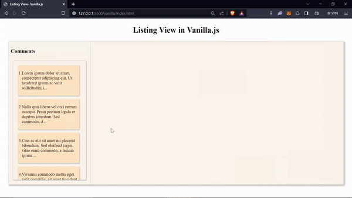

# Listing View

> This branch consists of creating a Listing View for comments and preview of the seleced comment in Vanilla js, react.js and Next.js

## Output

### Vanilla.js

### React.js

### Next.js
